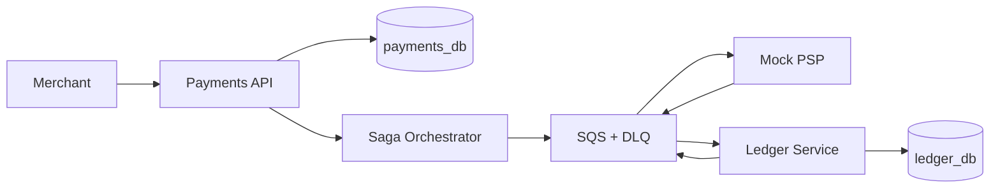

# Resilient Payment Orchestration Platform

An AWS-based system for reliable payments, double-entry accounting, and distributed transaction recovery.

## Outcome

Build a B2B payment API that authenticates merchants, processes payments through a simulated provider, records double-entry ledger entries, and resolves partial failures through a Saga, compensations, and reconciliation.

No real cards, accounts, or money are used. This is a production-inspired learning project, not a PCI DSS-compliant system.

## Target Architecture



To control costs, all containers run as ECS tasks on one EC2 instance, and one RDS instance hosts separate logical databases. Extra capacity is created only for the final reliability exercises.

| Area | Technology |
| --- | --- |
| Backend | Go, pgx, goose |
| APIs | HTTP/JSON, OpenAPI, oapi-codegen |
| Data | PostgreSQL on RDS |
| Messaging | SQS Standard and DLQs |
| Compute | Docker, ECR, ECS on EC2 |
| Service discovery | ECS Service Connect |
| Infrastructure | Terraform |
| Secrets | AWS Secrets Manager |
| Access | AWS Systems Manager Session Manager |
| Observability | slog, OpenTelemetry, ADOT, CloudWatch, X-Ray |
| Source control and CI | Git, GitHub, GitHub Actions |

## Cross-Cutting Practices

- **Git/GitHub:** protect `main`, use small pull requests, and create a `phase-N` tag after each phase.
- **Unit tests:** cover money rules, state transitions, idempotency, and ledger balance on every PR.
- **Integration tests:** use PostgreSQL in Docker for migrations, repositories, outbox, and inbox.
- **E2E tests:** keep a few critical scenarios against AWS and run them after deployment.
- **Diagrams:** store Mermaid diagrams under `docs/diagrams/`.
  - Update the current AWS architecture diagram in every phase.
  - Add at least one sequence diagram for the implemented flow.
  - Show only what exists: boundaries, databases, calls, and messages.
- **Money:** use integer minor units and an explicit currency; never use floating point.
- **Consistency:** every state-changing request and message must be idempotent. Never assume exactly-once delivery or distributed ACID transactions.
- **Identity:** derive `merchant_id` from the credential, never from the request body.

## Implementation Plan

### Phase 1 — Platform Smoke Test: From Empty Repository to CRUD on AWS

**Outcome:** a disposable CRUD proves the complete GitHub → Terraform → ECR/ECS → RDS path.

**Execute**

1. Choose the AWS account, region, project name, and mandatory tags. Use AWS CLI with SSO or an assumed role; never use the root account.
2. Create the GitHub repository, protect `main`, and run format, lint, unit tests, build, and secret scanning on every PR.
3. Create a one-time `bootstrap` stack containing:
   - an encrypted, versioned S3 Terraform backend with native state locking;
   - an AWS Budget;
   - a GitHub Actions OIDC deployment role.
4. Pin Terraform and provider versions, and commit `.terraform.lock.hcl`.
5. Provision with Terraform:
   - VPC and security groups;
   - an immutable ECR repository with basic scanning and a lifecycle policy;
   - ECS, an ASG with capacity `0–1`, and an EC2 capacity provider with managed scaling and draining;
   - one encrypted RDS PostgreSQL Single-AZ instance with seven-day automated backups;
   - separate migration and runtime database users;
   - Secrets Manager, IAM roles, Session Manager access, and CloudWatch Logs with short retention.
6. Implement a `smoke-api` with `/health`, `/ready`, and CRUD endpoints under `/smoke/items` backed by RDS.
7. Deploy a non-root image and run: create → restart ECS task → read → update → delete.
8. Run a second `terraform plan`, then test `lab-down` and `infra-up`.

**Exit criteria**

- **Functional:** the CRUD works through an SSM tunnel and data survives an ECS task restart and a lab restart.
- **Architecture:** RDS is private, the EC2 instance has no inbound ports, and application tasks receive only the secret and permissions they need.
- **Technology:** the second Terraform plan has no unexpected changes; GitHub Actions uses OIDC, publishes a commit-SHA image, and deploys ECS.
- **Evidence:** current AWS diagram, CRUD sequence diagram, green CI run, E2E output, and startup/shutdown commands.

The `smoke-api` validates the platform only. Tag `phase-1`, then remove it in the next phase.

### Phase 2 — Merchant Access: Authentication and Authorization

**Outcome:** the deployed Payments API derives merchant identity from a revocable credential.

**Execute**

1. Replace `smoke-api` with Payments API while keeping the established pipeline and infrastructure.
2. Implement `/health`, `/ready`, and `/v1/me`.
3. Store API keys as hashes and support scopes and revocation.
4. Add a CLI command that issues a key once and another that revokes it.
5. Automate E2E tests for valid, invalid, and revoked credentials.

**Exit criteria**

- **Functional:** `/v1/me` identifies the merchant; invalid, revoked, or insufficiently scoped keys are rejected.
- **Architecture:** `merchant_id` always comes from authentication; secrets and configuration remain outside the image.
- **Technology:** unit tests cover authentication and scopes; OpenAPI defines the contract; CI deploys the image identified by the commit SHA.
- **Evidence:** authentication sequence diagram, OpenAPI document, and E2E output.

### Phase 3 — Complete Payment: PSP, State Machine, and Ledger

**Outcome:** an approved payment reaches `SUCCEEDED` and creates exactly one balanced ledger entry. Coordination is still synchronous.

**Execute**

1. Build Mock PSP with `authorize`, `capture`, `void`, lookup by idempotency key, and configurable failures.
2. Build Ledger Service with accounts, journal entries, postings, reversals, and idempotency.
3. Add `POST /v1/payments` and `GET /v1/payments/{id}` with a persistent state machine and `Idempotency-Key`.
4. Connect Payments, PSP, and Ledger through ECS Service Connect.
5. Test approval, rejection, repeated requests, tenant isolation, and timeout.

**Exit criteria**

- **Functional:** approval creates one entry; rejection creates none; repeated keys do not duplicate effects; timeout produces `CAPTURE_UNKNOWN`.
- **Architecture:** Payments, PSP, and Ledger are separate processes with separate logical databases and users; Ledger balances every entry in one local transaction.
- **Technology:** OpenAPI defines the APIs; unit tests cover states and balance; integration tests cover PostgreSQL and service adapters.
- **Evidence:** component diagram and sequence diagrams for approval, rejection, and timeout.

### Phase 4 — Durable Execution: SQS, Outbox, and Inbox

**Outcome:** payments run in the background and survive restarts, duplicate messages, and failures around persistence and publication.

**Execute**

1. Provision `psp-commands`, `ledger-commands`, `payment-events`, and one DLQ per queue.
2. Add workflow, transactional outbox, and inbox tables.
3. Make `POST /payments` store the payment, workflow, and first command in one transaction.
4. Build the outbox publisher, idempotent workers, and persistent orchestrator.
5. Test duplicate messages and crashes between `commit/publish` and `effect/ack`.

**Exit criteria**

- **Functional:** the API returns a pending payment; restarts do not lose or duplicate captures or entries; a poison message reaches the DLQ.
- **Architecture:** domain change and outbox share a transaction; inbox and local effect share a transaction; only the orchestrator advances the workflow.
- **Technology:** consumers use bounded concurrency, correct visibility timeouts, and graceful shutdown; integration and E2E tests cover replay and restart.
- **Evidence:** queue topology diagram and a sequence diagram showing publish, consume, duplicate, and retry.

### Phase 5 — Financial Recovery: Saga, Compensation, and Reconciliation

**Outcome:** ambiguous and partial failures end in reconciliation, explicit compensation, or manual review.

**Execute**

1. Turn the workflow into a Saga with explicit states and compensations.
2. Add HMAC-signed webhooks, backoff with jitter, and a circuit breaker.
3. Resolve `CAPTURE_UNKNOWN` by querying the PSP; use `MANUAL_REVIEW` when certainty is impossible.
4. Add `POST /v1/payments/{id}/refunds` as a separate Saga.
5. Implement void, refund, reversing ledger entry, reconciliation, and safe DLQ redrive.
6. Export OpenTelemetry traces through an ADOT collector to X-Ray.

**Exit criteria**

- **Functional:** an ambiguous capture is never repeated blindly; a repeated refund creates one refund; out-of-order messages cannot trigger invalid transitions.
- **Architecture:** every compensation is explicit; refunds reference the original payment; reconciliation follows the same idempotency rules.
- **Technology:** CloudWatch alerts on DLQs, delayed outbox records, and stuck Sagas; logs and traces carry payment, Saga, and message IDs.
- **Evidence:** Saga state diagram, ambiguous-capture and refund sequences, E2E traces, and operational runbooks.

### Phase 6 — Production Drill: Load, Failure, and Recovery

**Outcome:** measurable evidence of scaling, continuity, rollback, restore, and diagnosis. Additional resources are removed afterward.

**Execute**

1. Temporarily add an ALB, a second EC2 instance, worker replicas, dashboards, and alarms through Terraform.
2. Measure throughput, p95/p99 latency, errors, and queue backlog with k6.
3. Terminate one EC2 instance during load and verify managed draining and recovery.
4. Slow down the PSP and observe timeouts, the circuit breaker, and queue buffering.
5. Deploy a faulty image, roll it back, and restore an RDS snapshot into a temporary instance.
6. Write a postmortem and destroy the temporary capacity.

**Exit criteria**

- **Functional:** losing one EC2 instance loses no payments; multiple replicas duplicate no monetary effects; rollback and restore follow tested runbooks.
- **Architecture:** tasks are stateless, shutdown gracefully, and use coordinated timeout and retry policies; alarms point to concrete actions.
- **Technology:** scaling and alarms are Terraform-managed; GitHub Actions promotes the same commit-SHA image; k6 results are versioned.
- **Evidence:** scaled AWS diagram, failure-and-recovery sequence, metrics, restore validation, and postmortem.

## Minimum Commands

```text
make test          # unit and integration tests
make bootstrap     # create shared Terraform state and CI identity
make image         # build container images
make infra-up      # create or start the AWS lab
make deploy        # publish to ECR and update ECS
make e2e           # test the deployed phase
make lab-down      # set ECS and ASG to 0; stop RDS
make lab-destroy   # snapshot if required, then destroy the lab stack
```

RDS automatically restarts after seven days in the stopped state. For longer breaks, verify the backup and destroy the lab stack while preserving the bootstrap stack.
